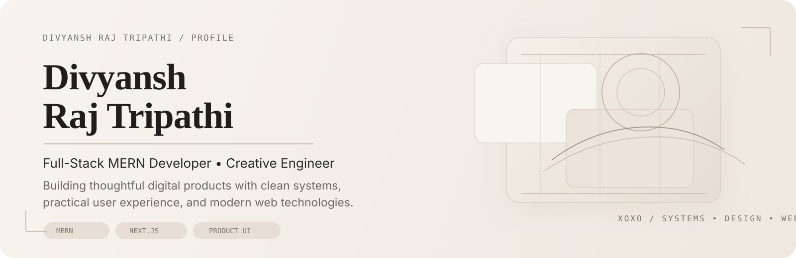

<h1 align="center">Divyansh Raj Tripathi</h1>

  <strong>Full-Stack MERN Developer • Creative Engineer • Building Thoughtful Web Products</strong> 
  Turning ideas into clean, performant, production-ready experiences.

  

  
  
  

  <a href="https://www.linkedin.com/in/divyansh-raj-tripathi-3211b8266">LinkedIn</a> ·
  <a href="https://xoxo-divyansh.github.io/portfolio/">Portfolio</a> ·
  <a href="mailto:drt.vip777@gmail.com">Email</a>

---

## About

I’m a full-stack developer focused on building practical digital products with clean architecture, modern interfaces, and thoughtful user experience.

My work combines backend structure, frontend presentation, and product thinking to create applications that feel usable, polished, and real-world ready.

---

## What I Bring

- End-to-end full-stack product development
- Clean API design and maintainable backend structure
- Responsive and modern frontend execution
- Performance-conscious implementation
- Practical deployment workflows using GitHub and Vercel

---

## Tech Stack

  

---

## Selected Work

<table>
  <tr>
    <td width="50%" valign="top">
      <h3>IronPulse Fitness</h3>
      

        A production-ready gym website built with a strong focus on real business use,
        including structured pages, SEO-ready architecture, lead capture flows, and
        polished frontend execution with Next.js.
      

      

        <a href="https://ironpulse-fitness-mocha.vercel.app">Live</a> ·
        <a href="https://github.com/xoxo-Divyansh/ironpulse-fitness">Repository</a>
      

    </td>
    <td width="50%" valign="top">
      <h3>Portfolio — Echoes of xoxo</h3>
      

        A cinematic portfolio experience centered on editorial layout, visual identity,
        and structured storytelling, designed to reflect product thinking and design sensitivity.
      

      

        <a href="https://xoxo-divyansh.github.io/portfolio/">Live</a> ·
        <a href="https://github.com/xoxo-Divyansh/portfolio">Repository</a>
      

    </td>
  </tr>
  <tr>
    <td width="50%" valign="top">
      <h3>OneTool</h3>
      

        A modular multi-utility platform featuring productivity and developer tools such as
        JSON formatting, API testing, and PDF workflows, built with scalability and usability in mind.
      

      

        <a href="https://one-tool-xoxo.vercel.app">Live</a> ·
        <a href="https://github.com/xoxo-Divyansh/OneTool">Repository</a>
      

    </td>
    <td width="50%" valign="top">
      <h3>Noorvii Shayaris</h3>
      

        A content-driven shayari experience focused on immersive presentation, mood-based flow,
        and expressive frontend interaction with a storytelling-first approach.
      

      

        <a href="https://github.com/xoxo-Divyansh/noorvii-shayaries">Repository</a>
      

    </td>
  </tr>
</table>

---

## GitHub Stats

  
  

---

## Growth Journey

| Year | Focus |
|------|------|
| 2023 | Backend fundamentals and Node.js projects |
| 2024 | Full MERN applications and deployment |
| 2025 | Built OneTool with stronger UI, APIs, and product structure |
| 2026 | Exploring Next.js, TypeScript, and DevOps workflows |

---

## Current Focus

- Building scalable tools and real-world applications
- Improving interface quality and product presentation
- Growing in Next.js, TypeScript, and system design
- Learning stronger development and deployment workflows

---

## Let’s Connect

  
  
  

---

  Open to internships, freelance opportunities, and meaningful collaborations.

