<h1 align="center">🌌 Divyansh Raj Tripathi</h1>

  <b>Full-Stack MERN Developer • Creative Engineer • Building Scalable Web Experiences</b> 
  Turning ideas into performant, production-ready applications 🚀

  

  
  
  

---

## 💼 About Me

- 🔹 Full-stack developer focused on **real-world MERN applications**
- 🔹 Strong interest in **scalable backend systems, product thinking, and modern UI**
- 🔹 I enjoy building products that feel **clean, interactive, and production-ready**
- 🔹 Currently growing with **Next.js, TypeScript, Docker, and system design**

---

## ⚡ What I Bring

- ✅ End-to-end full-stack product development  
- ✅ Clean backend architecture with practical API design  
- ✅ Responsive, modern, and engaging frontend interfaces  
- ✅ Performance-focused development and better UX decisions  
- ✅ Deployment-ready workflows using modern tools like Vercel and GitHub  

---

## 🛠️ Tech Stack

  

---

## 🌟 Featured Projects

<table>
  <tr>
    <td width="50%" valign="top">
      <h3>🚀 OneTool</h3>
      

        An all-in-one utility platform with multiple tools like PDF workflows, generators, converters, and productivity utilities.
      

      

        <a href="https://one-tool-xoxo.vercel.app">🔗 Live Demo</a> 
        <a href="https://github.com/xoxo-Divyansh/OneTool">📦 GitHub Repo</a>
      

    </td>
    <td width="50%" valign="top">
      <h3>🍔 Reels Food App</h3>
      

        A full-stack MERN food ordering platform with authentication, dynamic UI, and practical product flow.
      

      

        <a href="https://github.com/xoxo-Divyansh/Reels-Foods-app">📦 GitHub Repo</a>
      

    </td>
  </tr>

  <tr>
    <td width="50%" valign="top">
      <h3>🎵 Mood-Based Music Player</h3>
      

        A frontend-focused interactive music app that changes the listening flow based on the user's selected mood.
      

      

        <a href="https://github.com/xoxo-Divyansh/Mood-Based-Music-Player">📦 GitHub Repo</a>
      

    </td>
    <td width="50%" valign="top">
      <h3>📌 Pinterest Web App</h3>
      

        A UI-focused project centered on responsive layouts, visual composition, and frontend interaction patterns.
      

      

        <a href="https://github.com/xoxo-Divyansh/pinterest-web-app">📦 GitHub Repo</a>
      

    </td>
  </tr>
</table>

---

## 📊 GitHub Stats

  
  

---

## 📈 Growth Journey

| Year | Focus |
|------|------|
| 2023 | Backend fundamentals & Node.js projects |
| 2024 | Full MERN applications & deployment |
| 2025 | Built OneTool + advanced UI/UX & APIs |
| 2026 | Exploring Next.js, TypeScript, DevOps |

---

## 🎯 Current Focus

- 🚀 Building scalable tools and real-world web applications  
- 🎨 Improving UI/UX with creative frontend execution  
- ⚙️ Learning system design, DevOps, and better product architecture  

---

## 🌐 Connect With Me

  
  
  

---

## 💬 Let’s Collaborate

  💡 Open to internships, freelance projects, and meaningful collaborations  
  🚀 Let’s build something impactful together

